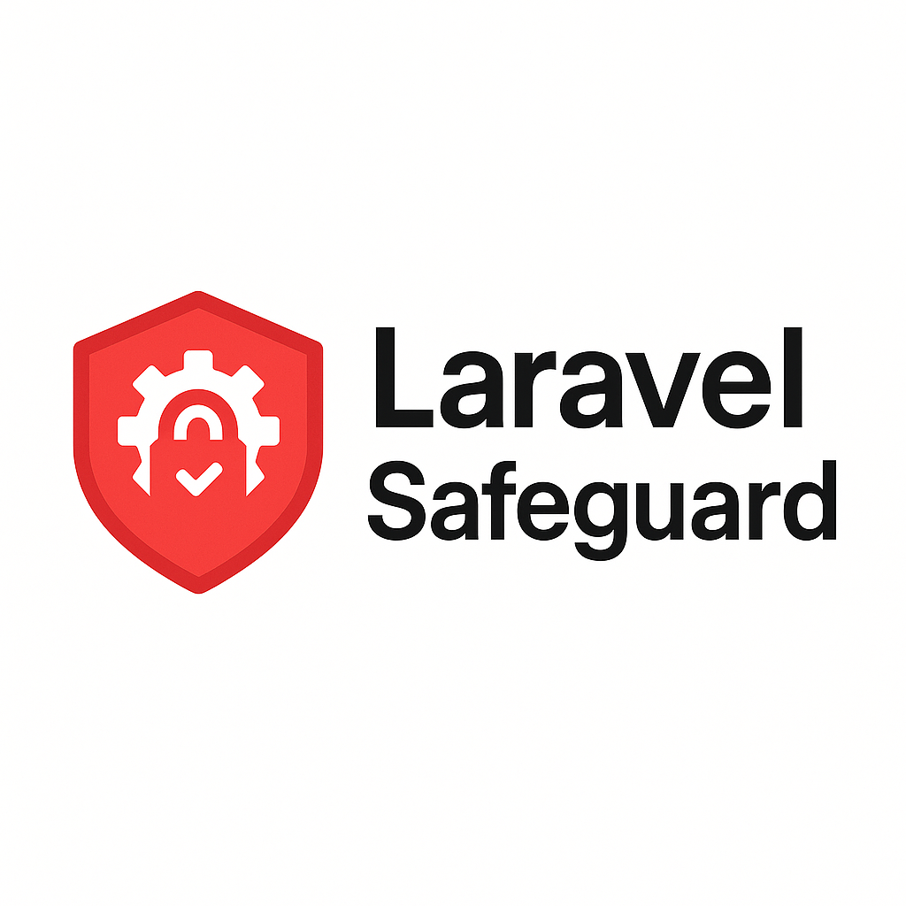

# Laravel Safeguard

<div align="center">
  
  <p><strong>Configurable security checks for Laravel applications — Run safety audits on environment variables, configuration files, and hidden routes to prevent common mistakes before going live.</strong></p>
  
  [](https://packagist.org/packages/grazulex/laravel-safeguard)
  [](https://packagist.org/packages/grazulex/laravel-safeguard)
  [](LICENSE.md)
  [](https://php.net)
  [](https://laravel.com)
  [](https://github.com/Grazulex/laravel-safeguard/actions)
  [](https://github.com/Grazulex/laravel-safeguard/actions)
  [](https://github.com/laravel/pint)
</div>

## 🧠 Problem Solved

In real-world Laravel applications, many production issues come from misconfigured environments and security oversights:

- ❌ **Missing critical variables** (APP_KEY, DB_PASSWORD, etc.)
- 🔓 **Hardcoded secrets** in code instead of environment variables
- 🚨 **Inconsistencies** between `.env.example` and `.env`
- 🗑️ **Unused or legacy keys** inherited from other projects
- ⚠️ **Security misconfigurations** (ex: `APP_DEBUG=true` in production)
- 🔒 **Insecure defaults** that should be changed before going live

Laravel Safeguard acts like **Pint, PHPStan, or Rector** but for **security and configuration auditing** — with configurable rules you can enable/disable based on your needs.

## ✨ Features

🔧 **Configurable Rules System** — Enable/disable security checks via `config/safeguard.php`  
🔐 **Environment Security** — Verify `.env` files, detect secrets in code, validate required keys  
⚙️ **Application Configuration** — Check Laravel-specific security settings  
🛡️ **Production Safety** — Prevent common production mistakes before deployment  
📊 **Multiple Output Formats** — CLI, JSON, or CI-friendly reporting  
🚀 **CI/CD Integration** — Perfect for GitHub Actions, GitLab CI, and other pipelines  

## 📦 Installation

Install the package via Composer:

```bash
composer require --dev grazulex/laravel-safeguard
```

Publish the configuration file:

```bash
php artisan vendor:publish --tag=safeguard-config
```

## 🔧 Configuration

The package includes a comprehensive configuration file at `config/safeguard.php`:

```php
<?php

return [
    'rules' => [
        // 🔐 Environment & Secrets
        'env_debug_false_in_production' => true,
        'env_has_all_required_keys' => true,
        'no_secrets_in_code' => true,
        'no_unused_env_keys' => false,
        'no_example_mismatch' => true,

        // ⚙️ Application Configuration
        'app_key_is_set' => true,
        'no_test_routes_in_production' => true,
        'storage_writable' => true,

        // 🛡️ Laravel Security
        'csrf_enabled' => true,
        'secure_cookies_in_production' => true,
        'no_forgotten_admin_routes' => true,
        'session_secure_in_production' => true,
        'https_enforced_in_production' => false,
    ],

    // 🎯 Environment-specific rules
    'environments' => [
        'production' => [
            'env_debug_false_in_production',
            'secure_cookies_in_production',
            'https_enforced_in_production',
        ],
        'staging' => [
            'env_debug_false_in_production',
            'csrf_enabled',
        ],
    ],

    // 📁 Paths to scan for secrets and unused variables
    'scan_paths' => [
        'app/',
        'config/',
        'routes/',
        'resources/views/',
    ],

    // 🔍 Secret patterns to detect in code
    'secret_patterns' => [
        '*_KEY',
        '*_SECRET',
        '*_TOKEN',
        '*_PASSWORD',
        'API_*',
    ],
];
```

## 🖥️ Usage

### Basic Security Check

Run all enabled security rules:

```bash
php artisan safeguard:check
```

### Environment-Specific Checks

Run checks for a specific environment:

```bash
php artisan safeguard:check --env=production
```

### Single Rule Testing

Test a specific rule in isolation:

```bash
php artisan safeguard:test-rule env_debug_false_in_production
```

### List Available Rules

See all available rules and their status:

```bash
php artisan safeguard:list
```

## 🔎 Example Output

```
🔐 Laravel Safeguard Security Check
═══════════════════════════════════════

Environment: production

✅ APP_KEY is set
✅ .env has all required keys from .env.example  
❌ APP_DEBUG is true in production
❌ Secret found in config/services.php (TWILIO_SECRET)
✅ CSRF protection enabled
✅ Storage directories are writable
⚠️  Rule "no_unused_env_keys" is disabled

═══════════════════════════════════════
🎯 2 issues found, 4 checks passed
```

### JSON Output

For programmatic use or CI integration:

```bash
php artisan safeguard:check --format=json
```

```json
{
  "status": "failed",
  "environment": "production",
  "summary": {
    "total": 6,
    "passed": 4,
    "failed": 2,
    "disabled": 1
  },
  "results": [
    {
      "rule": "env_debug_false_in_production",
      "status": "failed",
      "message": "APP_DEBUG is true in production",
      "severity": "error"
    }
  ]
}
```

## 🧪 CI/CD Integration

### GitHub Actions

```yaml
name: Security Audit

on: [push, pull_request]

jobs:
  security:
    runs-on: ubuntu-latest
    steps:
      - uses: actions/checkout@v4
      
      - name: Setup PHP
        uses: shivammathur/setup-php@v2
        with:
          php-version: 8.3
          
      - name: Install dependencies
        run: composer install
        
      - name: Run Laravel Safeguard
        run: php artisan safeguard:check --ci --fail-on-error
```

### GitLab CI

```yaml
security_audit:
  stage: test
  script:
    - composer install
    - php artisan safeguard:check --ci --fail-on-error
  only:
    - merge_requests
    - main
```

## 📋 Available Rules

### 🔐 Environment & Secrets
- `env_debug_false_in_production` — Ensures APP_DEBUG is false in production
- `env_has_all_required_keys` — Validates all .env.example keys exist in .env
- `no_secrets_in_code` — Detects hardcoded secrets in your codebase
- `no_unused_env_keys` — Identifies unused environment variables
- `no_example_mismatch` — Ensures .env and .env.example are in sync

### ⚙️ Application Configuration
- `app_key_is_set` — Verifies Laravel APP_KEY is generated
- `no_test_routes_in_production` — Prevents test routes in production
- `storage_writable` — Checks storage directories are writable

### 🛡️ Laravel Security
- `csrf_enabled` — Ensures CSRF protection is active
- `secure_cookies_in_production` — Validates secure cookie settings
- `session_secure_in_production` — Checks session security configuration
- `https_enforced_in_production` — Verifies HTTPS enforcement
- `no_forgotten_admin_routes` — Detects potentially dangerous admin routes

## 🔨 Custom Rules

Create your own security rules by extending the base rule class:

```bash
php artisan safeguard:make-rule CustomSecurityRule
```

This generates a new rule class in `app/SafeguardRules/`:

```php
<?php

namespace App\SafeguardRules;

use Grazulex\LaravelSafeguard\Contracts\SafeguardRule;
use Grazulex\LaravelSafeguard\Results\SafeguardResult;

class CustomSecurityRule implements SafeguardRule
{
    public function id(): string
    {
        return 'custom_security_rule';
    }

    public function description(): string
    {
        return 'Custom security validation';
    }

    public function check(): SafeguardResult
    {
        // Your custom logic here
        return SafeguardResult::passed('Custom check passed');
    }
}
```

## 🧪 Testing

Run the test suite:

```bash
composer test
```

Run with coverage:

```bash
composer test -- --coverage
```

## 📚 Documentation

For comprehensive documentation, see the [`docs/`](docs/) directory:

- **[Installation Guide](docs/installation.md)** - Step-by-step installation and setup
- **[Quick Start](docs/quick-start.md)** - Get up and running in minutes
- **[Configuration Guide](docs/configuration.md)** - Comprehensive configuration options
- **[Security Rules Reference](docs/rules-reference.md)** - Complete list of available rules
- **[Custom Rules Guide](docs/custom-rules.md)** - Create your own security rules
- **[CI/CD Integration](docs/ci-cd-integration.md)** - GitHub Actions, GitLab CI, and more
- **[Commands Reference](docs/commands.md)** - All available artisan commands
- **[Output Formats](docs/output-formats.md)** - CLI, JSON, and CI-friendly outputs
- **[FAQ](docs/faq.md)** - Frequently asked questions
- **[Troubleshooting](docs/troubleshooting.md)** - Common issues and solutions

## 💡 Examples

The [`examples/`](examples/) directory contains practical examples and code samples:

- **[Basic Usage](examples/basic-usage/)** - Simple examples to get started
- **[Custom Rules](examples/custom-rules/)** - Real-world custom security rules
- **[Configuration](examples/configuration/)** - Various configuration setups
- **[CI/CD](examples/ci-cd/)** - Ready-to-use CI/CD pipeline configurations
- **[Scripts](examples/scripts/)** - Utility scripts for automation

## 📈 Changelog

Please see [CHANGELOG](CHANGELOG.md) for more information on what has changed recently.

## 🤝 Contributing

Please see [CONTRIBUTING](CONTRIBUTING.md) for details.

## 🔒 Security Vulnerabilities

Please review [our security policy](../../security/policy) on how to report security vulnerabilities.

## 📄 License

The MIT License (MIT). Please see [License File](LICENSE.md) for more information.

## 💡 Credits

- [Jean-Marc Strauven](https://github.com/grazulex)
- [All Contributors](../../contributors)

---

**Laravel Safeguard** — Because security should be as simple as running `php artisan safeguard:check` ✅
