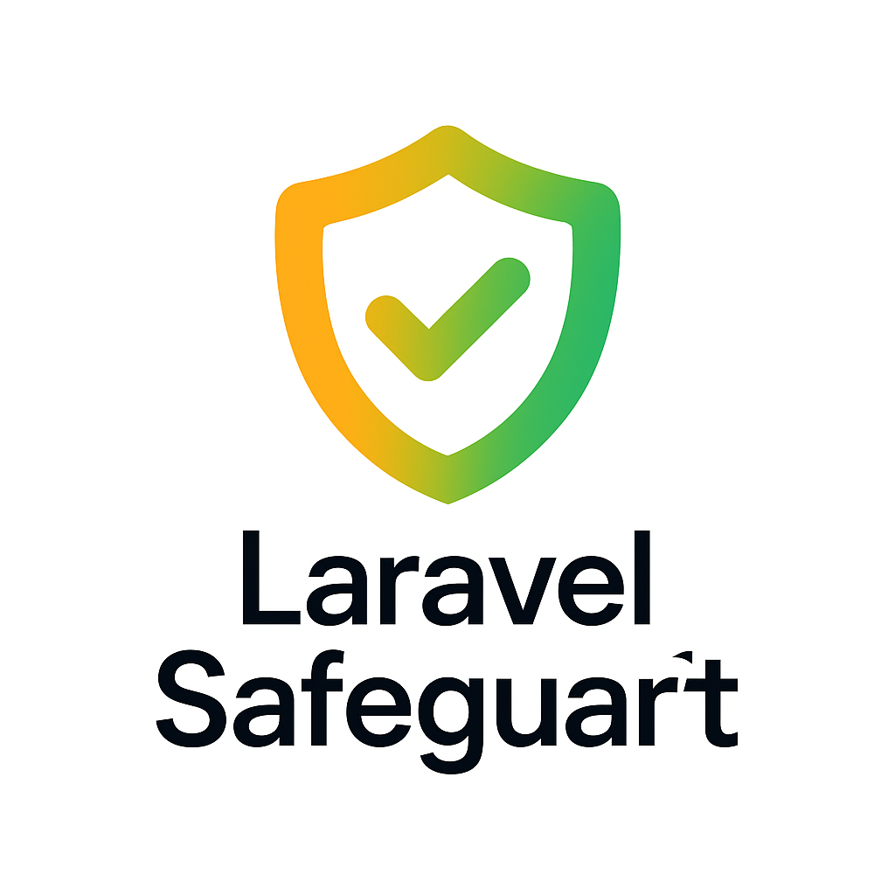

# Laravel Safeguard

<div align="center">
  
  <p><strong>Configurable security checks for Laravel applications — Run safety audits on environment variables, configuration files, and hidden routes to prevent common mistakes before going live.</strong></p>
  
  [](https://packagist.org/packages/grazulex/laravel-safeguard)
  [](https://packagist.org/packages/grazulex/laravel-safeguard)
  [](LICENSE.md)
  [](https://php.net)
  [](https://laravel.com)
  [](https://github.com/Grazulex/laravel-safeguard/actions)
  [](https://github.com/Grazulex/laravel-safeguard/actions)
  [](https://github.com/laravel/pint)
</div>

## <span style="color: #FF9900;">📊 Overview</span>

<div style="background: linear-gradient(135deg, #FF9900 0%, #D2D200 25%, #88C600 75%, #00B470 100%); padding: 20px; border-radius: 10px; margin: 20px 0; text-align: center;">
  <h3 style="color: white; text-shadow: 2px 2px 4px rgba(0,0,0,0.8); margin: 0 0 10px 0;">🔐 Configurable Security Auditing for Laravel</h3>
  <p style="color: white; text-shadow: 1px 1px 2px rgba(0,0,0,0.8); margin: 0; font-size: 16px;">Like <strong>Pint</strong>, <strong>PHPStan</strong>, or <strong>Rector</strong> — but for security and configuration auditing with detailed issue reporting and CI/CD integration</p>
</div>

## <span style="color: #D2D200;">🧠 Problem Solved</span>

In real-world Laravel applications, many production issues come from misconfigured environments and security oversights:

- ❌ **<span style="color: #FF9900;">Missing critical variables</span>** (APP_KEY, DB_PASSWORD, etc.)
- 🔓 **<span style="color: #D2D200;">Hardcoded secrets</span>** in code instead of environment variables
- 🚨 **<span style="color: #88C600;">Inconsistencies</span>** between `.env.example` and `.env`
- 🗑️ **<span style="color: #00B470;">Unused or legacy keys</span>** inherited from other projects
- ⚠️ **<span style="color: #FF9900;">Security misconfigurations</span>** (ex: `APP_DEBUG=true` in production)
- 🔒 **<span style="color: #D2D200;">Insecure defaults</span>** that should be changed before going live

<div style="border-left: 4px solid #88C600; padding-left: 15px; background-color: #f8f9fa; margin: 15px 0;">
  <p><strong style="color: #88C600;">Laravel Safeguard</strong> acts like <strong style="color: #FF9900;">Pint, PHPStan, or Rector</strong> but for <strong style="color: #00B470;">security and configuration auditing</strong> — with configurable rules you can enable/disable based on your needs.</p>
</div>

## <span style="color: #88C600;">✨ Features</span>

🔧 **<span style="color: #FF9900;">Configurable Rules System</span>** — Enable/disable security checks via `config/safeguard.php`  
🔐 **<span style="color: #D2D200;">Environment Security</span>** — Verify `.env` files, detect secrets in code, validate required keys  
⚙️ **<span style="color: #88C600;">Application Configuration</span>** — Check Laravel-specific security settings  
🛡️ **<span style="color: #00B470;">Production Safety</span>** — Prevent common production mistakes before deployment  
📊 **<span style="color: #FF9900;">Multiple Output Formats</span>** — CLI, JSON, or CI-friendly reporting with **detailed issue descriptions**  
🚀 **<span style="color: #D2D200;">CI/CD Integration</span>** — Perfect for GitHub Actions, GitLab CI, and other pipelines  

## <span style="color: #00B470;">📦 Installation</span>

Install the package via Composer:

```bash
composer require --dev grazulex/laravel-safeguard
```

Publish the configuration file:

```bash
php artisan vendor:publish --tag=safeguard-config
```

## <span style="color: #FF9900;">🔧 Configuration</span>

<div style="border-left: 4px solid #FF9900; padding-left: 15px; background-color: #fff8f0; margin: 15px 0;">
  <p>The package includes a comprehensive configuration file at <code style="color: #FF9900;">config/safeguard.php</code>:</p>
</div>

```php
<?php

return [
    'rules' => [
        // 🔐 Environment & Configuration
        'app-debug-false-in-production' => true,
        'env-has-all-required-keys' => true,
        'app-key-is-set' => true,
        'no-secrets-in-code' => true,

        // 🛡️ Security Rules
        'csrf-enabled' => true,
        'composer-package-security' => true,

        // 📁 File System Security
        'env-file-permissions' => true,

        // 🗄️ Database Security
        'database-connection-encrypted' => true,
        'database-credentials-not-default' => true,
        'database-backup-security' => true,
        'database-query-logging' => true,

        // 🔑 Authentication Security
        'password-policy-compliance' => true,
        'two-factor-auth-enabled' => true,
        'session-security-settings' => true,

        // 🔒 Encryption Security
        'encryption-key-rotation' => true,
        'sensitive-data-encryption' => true,
    ],

    // 🎯 Environment-specific rules
    'environments' => [
        'production' => [
            'app-debug-false-in-production',
            'app-key-is-set',
            'env-file-permissions',
            'database-connection-encrypted',
            'password-policy-compliance',
            'encryption-key-rotation',
        ],
        'staging' => [
            'app-debug-false-in-production',
            'csrf-enabled',
            'database-connection-encrypted',
        ],
    ],

    // 📁 Paths to scan for secrets
    'scan_paths' => [
        'app/',
        'config/',
        'routes/',
        'resources/views/',
    ],

    // 🔍 Secret patterns to detect in code
    'secret_patterns' => [
        '*_KEY',
        '*_SECRET',
        '*_TOKEN',
        '*_PASSWORD',
        'API_*',
    ],
];
```

## <span style="color: #D2D200;">🖥️ Usage</span>

### <span style="color: #88C600;">Basic Security Check</span>

Run all enabled security rules:

```bash
php artisan safeguard:check
```

### <span style="color: #00B470;">Environment-Specific Checks</span>

Run checks for a specific environment:

```bash
php artisan safeguard:check --env=production
```

### <span style="color: #FF9900;">Detailed Output</span>

<div style="border-left: 4px solid #D2D200; padding-left: 15px; background-color: #fffdf0; margin: 15px 0;">
  <p><strong style="color: #D2D200;">New!</strong> Show additional information for failed checks with <strong style="color: #88C600;">intelligent formatting</strong>:</p>
</div>

```bash
php artisan safeguard:check --details
```

Show detailed information for all checks:

```bash
php artisan safeguard:check --show-all
```

### <span style="color: #88C600;">List Available Rules</span>

See all available rules and their status:

```bash
php artisan safeguard:list
```

Filter rules by status or environment:

```bash
# Show only enabled rules
php artisan safeguard:list --enabled

# Show rules for specific environment
php artisan safeguard:list --environment=production

# Show rules by severity
php artisan safeguard:list --severity=critical
```

### <span style="color: #00B470;">Create Custom Rules</span>

Generate a new custom security rule:

```bash
php artisan safeguard:make-rule CustomSecurityRule
```

With specific severity level:

```bash
php artisan safeguard:make-rule CriticalSecurityRule --severity=error
```

## <span style="color: #FF9900;">🔎 Example Output</span>

### <span style="color: #D2D200;">Basic Output</span>

```
🔐 Laravel Safeguard Security Check
═══════════════════════════════════════

Environment: production

✅ APP_KEY is set
✅ All required environment variables present  
❌ APP_DEBUG is true in production
❌ Hardcoded secret found in config/services.php
✅ CSRF protection enabled
✅ Database connection uses encryption
✅ Password policy meets security standards
⚠️  Two-factor authentication not configured

═══════════════════════════════════════
🎯 2 critical issues, 1 warning found
```

### <span style="color: #88C600;">Detailed Output (with --details flag)</span>

<div style="border-left: 4px solid #88C600; padding-left: 15px; background-color: #f8fff8; margin: 15px 0;">
  <p><strong style="color: #88C600;">Enhanced!</strong> Now shows <strong style="color: #FF9900;">structured information</strong> with <strong style="color: #00B470;">icons and formatting</strong> for better readability:</p>
</div>

```
🔐 Laravel Safeguard Security Check
═══════════════════════════════════════

Environment: production

✅ APP_KEY is set
✅ All required environment variables present  
❌ APP_DEBUG is true in production
   💡 Current Setting: true
   💡 Recommendation: Set APP_DEBUG=false in production environment
   ⚠️ Security Impact: Debug mode exposes sensitive application information

❌ Hardcoded secret found in config/services.php
   📁 File Path: config/services.php
   📋 Issues Found:
     🔍 [CRITICAL] Secret Pattern - Package: config/services.php
       📝 STRIPE_SECRET detected on line 15
       ⚠️ Risk: Hardcoded secrets in configuration files
     🔍 [ERROR] Api Token - Package: config/services.php  
       📝 API_TOKEN detected on line 23
       � Reason: Should be moved to environment variables
   �💡 Recommendation: Move secrets to environment variables

✅ CSRF protection enabled
✅ Database connection uses encryption
✅ Password policy meets security standards
⚠️  Two-factor authentication not configured
   📌 Current Status: Not configured
   💡 Recommendation: Enable 2FA for enhanced security
   📋 Recommendations:
     • Install Laravel Fortify or similar 2FA package
     • Configure backup codes for account recovery

═══════════════════════════════════════
🎯 2 critical issues, 1 warning found
```

### <span style="color: #00B470;">JSON Output</span>

For programmatic use or CI integration:

```bash
php artisan safeguard:check --format=json
```

<div style="border-left: 4px solid #00B470; padding-left: 15px; background-color: #f0ffff; margin: 15px 0;">
  <p><strong style="color: #00B470;">Enhanced JSON:</strong> Now includes <strong style="color: #FF9900;">separated errors and warnings</strong> for better CI integration:</p>
</div>

```json
{
  "status": "failed",
  "environment": "production",
  "summary": {
    "total": 6,
    "passed": 4,
    "errors": 2,
    "warnings": 1
  },
  "results": {
    "errors": [
      {
        "rule": "app-debug-false-in-production",
        "status": "failed",
        "message": "APP_DEBUG is true in production",
        "severity": "error"
      }
    ],
    "warnings": [
      {
        "rule": "two-factor-auth-enabled", 
        "status": "warning",
        "message": "Two-factor authentication not configured",
        "severity": "warning"
      }
    ]
  }
}
```

## <span style="color: #88C600;">🧪 CI/CD Integration</span>

### <span style="color: #D2D200;">GitHub Actions</span>

```yaml
name: Security Audit

on: [push, pull_request]

jobs:
  security:
    runs-on: ubuntu-latest
    steps:
      - uses: actions/checkout@v4
      
      - name: Setup PHP
        uses: shivammathur/setup-php@v2
        with:
          php-version: 8.3
          
      - name: Install dependencies
        run: composer install
        
      - name: Run Laravel Safeguard
        run: php artisan safeguard:check --ci --fail-on-error
```

### <span style="color: #FF9900;">GitLab CI</span>

```yaml
security_audit:
  stage: test
  script:
    - composer install
    - php artisan safeguard:check --ci --fail-on-error
  only:
    - merge_requests
    - main
```

## <span style="color: #00B470;">📋 Available Rules</span>

### <span style="color: #FF9900;">🔐 Environment & Secrets</span>
- `env_debug_false_in_production` — Ensures APP_DEBUG is false in production
- `env_has_all_required_keys` — Validates all .env.example keys exist in .env
- `no_secrets_in_code` — Detects hardcoded secrets in your codebase
- `no_unused_env_keys` — Identifies unused environment variables
- `no_example_mismatch` — Ensures .env and .env.example are in sync

### <span style="color: #D2D200;">⚙️ Application Configuration</span>
- `app_key_is_set` — Verifies Laravel APP_KEY is generated
- `no_test_routes_in_production` — Prevents test routes in production
- `storage_writable` — Checks storage directories are writable

### <span style="color: #88C600;">🛡️ Laravel Security</span>
- `csrf_enabled` — Ensures CSRF protection is active
- `secure_cookies_in_production` — Validates secure cookie settings
- `session_secure_in_production` — Checks session security configuration
- `https_enforced_in_production` — Verifies HTTPS enforcement
- `no_forgotten_admin_routes` — Detects potentially dangerous admin routes

## <span style="color: #FF9900;">🔨 Custom Rules</span>

Create your own security rules by extending the base rule class:

```bash
php artisan safeguard:make-rule CustomSecurityRule
```

<div style="border-left: 4px solid #FF9900; padding-left: 15px; background-color: #fff8f0; margin: 15px 0;">
  <p>This generates a new rule class in <code style="color: #FF9900;">app/SafeguardRules/</code>:</p>
</div>

```php
<?php

namespace App\SafeguardRules;

use Grazulex\LaravelSafeguard\Contracts\SafeguardRule;
use Grazulex\LaravelSafeguard\Results\SafeguardResult;

class CustomSecurityRule implements SafeguardRule
{
    public function id(): string
    {
        return 'custom_security_rule';
    }

    public function description(): string
    {
        return 'Custom security validation';
    }

    public function check(): SafeguardResult
    {
        // Your custom logic here
        return SafeguardResult::passed('Custom check passed');
    }
}
```

## <span style="color: #D2D200;">🧪 Testing</span>

Run the test suite:

```bash
composer test
```

Run with coverage:

```bash
composer test -- --coverage
```

## <span style="color: #88C600;">📚 Documentation</span>

For comprehensive documentation, see the [`docs/`](docs/) directory:

- **[<span style="color: #FF9900;">Installation Guide</span>](docs/installation.md)** - Step-by-step installation and setup
- **[<span style="color: #D2D200;">Quick Start</span>](docs/quick-start.md)** - Get up and running in minutes
- **[<span style="color: #88C600;">Configuration Guide</span>](docs/configuration.md)** - Comprehensive configuration options
- **[<span style="color: #00B470;">Security Rules Reference</span>](docs/rules-reference.md)** - Complete list of available rules
- **[<span style="color: #FF9900;">Custom Rules Guide</span>](docs/custom-rules.md)** - Create your own security rules
- **[<span style="color: #D2D200;">CI/CD Integration</span>](docs/ci-cd-integration.md)** - GitHub Actions, GitLab CI, and more
- **[<span style="color: #88C600;">Commands Reference</span>](docs/commands.md)** - All available artisan commands
- **[<span style="color: #00B470;">Output Formats</span>](docs/output-formats.md)** - CLI, JSON, and CI-friendly outputs
- **[<span style="color: #FF9900;">FAQ</span>](docs/faq.md)** - Frequently asked questions
- **[<span style="color: #D2D200;">Troubleshooting</span>](docs/troubleshooting.md)** - Common issues and solutions

## <span style="color: #00B470;">💡 Examples</span>

The [`examples/`](examples/) directory contains practical examples and code samples:

- **[<span style="color: #88C600;">Basic Usage</span>](examples/basic-usage/)** - Simple examples to get started
- **[<span style="color: #FF9900;">Custom Rules</span>](examples/custom-rules/)** - Real-world custom security rules
- **[<span style="color: #D2D200;">Configuration</span>](examples/configuration/)** - Various configuration setups
- **[<span style="color: #00B470;">CI/CD</span>](examples/ci-cd/)** - Ready-to-use CI/CD pipeline configurations
- **[<span style="color: #88C600;">Scripts</span>](examples/scripts/)** - Utility scripts for automation

## <span style="color: #FF9900;">📈 Changelog</span>

Please see [<span style="color: #D2D200;">CHANGELOG</span>](CHANGELOG.md) for more information on what has changed recently.

## <span style="color: #88C600;">🤝 Contributing</span>

Please see [<span style="color: #00B470;">CONTRIBUTING</span>](CONTRIBUTING.md) for details.

## <span style="color: #FF9900;">🔒 Security Vulnerabilities</span>

Please review [<span style="color: #D2D200;">our security policy</span>](../../security/policy) on how to report security vulnerabilities.

## <span style="color: #88C600;">📄 License</span>

The MIT License (MIT). Please see [<span style="color: #00B470;">License File</span>](LICENSE.md) for more information.

## <span style="color: #FF9900;">💡 Credits</span>

- [<span style="color: #D2D200;">Jean-Marc Strauven</span>](https://github.com/grazulex)
- [<span style="color: #88C600;">All Contributors</span>](../../contributors)

---

<div style="text-align: center; padding: 20px; background: linear-gradient(90deg, #FF9900 0%, #D2D200 50%, #88C600 100%); border-radius: 10px; margin: 20px 0;">
  <p style="color: white; text-shadow: 1px 1px 2px rgba(0,0,0,0.8); margin: 0; font-size: 18px; font-weight: bold;">
    <strong>Laravel Safeguard</strong> — Because security should be as simple as running <code style="background: rgba(255,255,255,0.2); padding: 2px 6px; border-radius: 4px;">php artisan safeguard:check</code> ✅
  </p>
</div>
